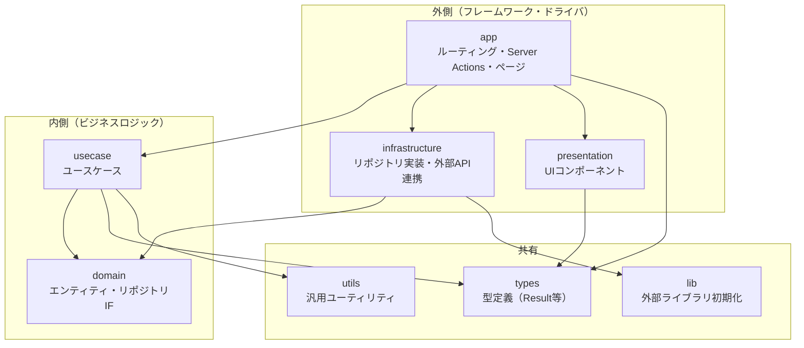

# 味を継承するファミリーカプセルクッキング（FCC）

## 設計
### クリーンアーキテクチャ
今回はクリーンアーキテクチャ（レイヤードアーキテクチャ風）を採用しました。

#### 採用理由
- 各処理の「関心分離」を深く理解するため
データの永続化とビジネスロジック、UIの責務分離を体感してフロントエンドの設計についての理解を深めたいと考えました。
- 設計思想の学習と実践のため
ただ動くものではなく、依存性の逆転などの設計原則をプロジェクトに落とし込むことで、保守性の高いコードを書く基礎体力をつけようと考えました。
- 小中規模開発における「最適な設計の勘所」を掴むため
あえて過度に細かく分割する経験を通じ、実務においてどの程度の抽象化が適切かのバランス感覚を養いたいと考えました。
- 生成AI活用によるコーディングコスト低下による将来性を考慮
クリーンアーキテクチャの弱点であった実装コストが解決されつつあり、生成AIが理解しやすく、ハルシネーションを起こしにくい分割されたコードが将来的なコスト削減につながると考えました。

#### アーキテクチャ図（依存関係）

依存の向きは **presentation → usecase → domain** および **app → infrastructure** を守ります。内側の層は外側の層に依存しません。



- **app**: コンポジションルート。UseCase と Repository を組み立て、Server Action でエラー変換などを行う。
- **usecase**: domain（リポジトリインターフェース）のみに依存。infrastructure は import しない。
- **domain**: 他レイヤーに依存しない最内層。
- **infrastructure**: domain のインターフェースを実装し、Supabase 等の外部システムと連携する。

#### ディレクトリ構成図

```
src/
├── app/                    # Next.js App Router・Server Actions
│   ├── (auth)/login/       # ログイン
│   ├── (auth)/signup/      # サインアップ
│   └── top/                # トップページ
├── presentation/           # プレゼンテーション層（UI）
│   └── components/
├── usecase/                # ユースケース層
│   └── auth/
├── domain/                 # ドメイン層
│   └── repositories/      # リポジトリインターフェース・エンティティ
├── infrastructure/         # インフラストラクチャ層
│   ├── repositories/      # リポジトリ実装
│   └── utils/             # インフラ固有ユーティリティ（例: エラー変換）
├── types/                  # 型定義（Result 等）
├── lib/                    # 外部ライブラリの設定・クライアント
└── utils/                  # 汎用ユーティリティ（Supabase 非依存のバリデーション等）
```

#### 各層の責務

| 層 | 責務 | 依存してよいもの |
|----|------|------------------|
| **app** | ルーティング、ページ、Server Actions。UseCase と Repository の組み立て（DI） | usecase, infrastructure, presentation, types |
| **presentation** | 再利用可能な UI コンポーネント | types, app の Action |
| **usecase** | アプリケーション固有のビジネスロジック（バリデーション、リポジトリ呼び出し） | domain, types, utils（Supabase 非依存） |
| **domain** | エンティティ、リポジトリインターフェース、ドメインの型 | なし（最内層） |
| **infrastructure** | リポジトリ実装、外部 API・DB 連携、Supabase 固有のエラー変換など | domain, lib |
| **types** | アプリ全体で使う型（Result パターン等）。ドメインの User を参照可 | domain |
| **utils** | 汎用ユーティリティ（バリデーション等）。Supabase に依存しない純粋関数 | なし |
| **lib** | Supabase クライアント等の初期化 | なし |

#### データの流れ（認証の例）

1. ユーザーがフォーム送信 → **presentation** のコンポーネントが **app** の Server Action を呼ぶ。
2. **app** が `AuthRepositoryImpl` と `LoginUseCase` を組み立て、`useCase.execute(input)` を実行。
3. **usecase** がバリデーション（utils/validation）を行い、**domain** の `AuthRepository` インターフェース経由でログイン処理を依頼。
4. **infrastructure** の `AuthRepositoryImpl` が Supabase と通信し、結果を返す。
5. 例外時は **app** の try/catch で `infrastructure/utils` のエラー変換を呼び、ユーザー向けメッセージを返す。

## 実装したい内容
- ログイン機能
  - 未ログイン時のリダイレクト処理をミドルウェアで作成
- ユーザー登録機能
  - ユーザー登録時のメール確認完了後のコールバック機能
- トップページ
  - お知らせ掲示板
- レシピ一覧
  - レシピ登録
  - レシピ修正
  - レシピ削除

## 将来的に実装したい内容
- 買い物リスト機能
  - レシピから追加する機能も追加予定