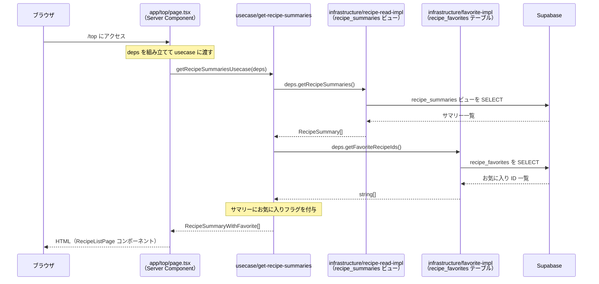
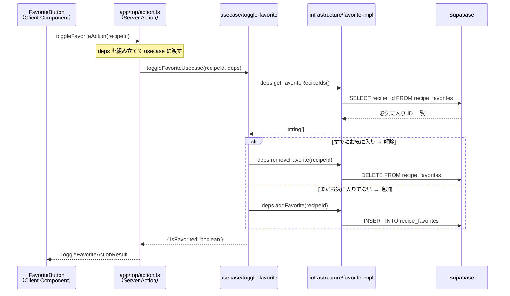
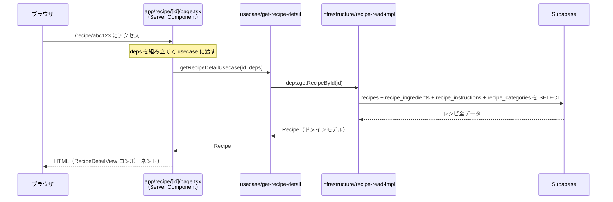

# レシピ参照機能 実装ガイド

## 1. 概要

レシピの「参照」機能を、既存のクリーンアーキテクチャに沿って実装するためのガイドです。
レシピ登録（Create）が `app → usecase → domain ← infrastructure` の流れで実装されているのと同じように、
参照（Read）も同じパターンで作ります。

### 作る画面

| 画面 | URL | 機能 |
|------|-----|------|
| トップ画面 | `/top` | レシピ一覧の表示・お気に入りフィルタ |
| レシピ参照画面 | `/recipe/[id]` | レシピ詳細の参照（材料・手順・カテゴリ） |

### 機能一覧

- **レシピ一覧表示** … 公開済みレシピ（`is_draft = false`）のサマリーをカード形式で表示
- **お気に入り登録/解除** … ハートアイコンをクリックしてトグル
- **お気に入りフィルタ** … トップ画面で「お気に入りのみ」に絞り込み
- **レシピ詳細表示** … 1 件のレシピを材料・手順・カテゴリ込みで表示

### 参照（Read）と登録（Create）の違い

| 観点 | 登録（Create） | 参照（Read） |
|------|---------------|-------------|
| データの流れ | 画面 → サーバー → DB | DB → サーバー → 画面 |
| app 層での入口 | Server Action（フォーム送信） | Server Component（ページ表示時にデータ取得） |
| usecase の仕事 | 複数リポジトリを順に呼んで保存 | リポジトリの get/find を呼んで返す |
| presentation | フォーム（Client Component） | 表示用コンポーネント（データを props で受け取る） |

> **ポイント**: 登録では presentation → Server Action → usecase という流れでしたが、
> 参照では **page.tsx（Server Component）が直接 usecase を呼んで**、結果を presentation に props で渡します。
> Server Action はお気に入りトグルのような**変更操作**にだけ使います。

---

## 2. 処理の流れ

### 2.1 トップ画面（レシピ一覧 + お気に入り）



### 2.2 お気に入りトグル



### 2.3 レシピ詳細画面



---

## 3. 作成ファイル一覧

開発順序（下位層 → 上位層）に並べています。

| # | 層 | ファイルパス | 役割 |
|---|---|---|---|
| 1 | DB | `supabase/migrations/20260314000001_create_recipe_favorites.sql` | お気に入りテーブルの作成 |
| 2 | Domain | `src/domain/models/recipe/recipe-summary.ts` | レシピサマリーの型定義 |
| 3 | Types | `src/types/recipe.ts` | お気に入りフラグ付きサマリー型など |
| 4 | Infra | `src/infrastructure/repositories/recipe/recipe-read-repository-impl.ts` | レシピ参照の DB 実装 |
| 5 | Infra | `src/infrastructure/repositories/recipe/favorite-repository-impl.ts` | お気に入りの DB 実装 |
| 6 | UseCase | `src/usecase/recipe/get-recipe-summaries-usecase.ts` | サマリー一覧取得 + お気に入りマージ |
| 7 | UseCase | `src/usecase/recipe/get-recipe-detail-usecase.ts` | レシピ詳細取得 |
| 8 | UseCase | `src/usecase/recipe/toggle-favorite-usecase.ts` | お気に入りトグル |
| 9 | App | `src/app/top/page.tsx` | トップ画面ページ |
| 10 | App | `src/app/top/action.ts` | お気に入りトグル Server Action |
| 11 | App | `src/app/recipe/[id]/page.tsx` | レシピ詳細ページ |
| 12 | Presentation | `src/presentation/components/recipe/RecipeCard.tsx` | レシピカード |
| 13 | Presentation | `src/presentation/components/recipe/RecipeListPage.tsx` | レシピ一覧（フィルタ付き） |
| 14 | Presentation | `src/presentation/components/recipe/RecipeDetailView.tsx` | レシピ詳細表示 |
| 15 | Presentation | `src/presentation/components/recipe/FavoriteButton.tsx` | お気に入りボタン |

---

## 4. 開発手順とコード

### ステップ 1: マイグレーション — お気に入りテーブル

**何をするか**: お気に入り機能に必要な `recipe_favorites` テーブルを DB に追加します。

**なぜ必要か**: 「どのユーザーが、どのレシピをお気に入りしているか」を保存する場所が必要です。

> **解説**: `primary key (user_id, recipe_id)` にすることで、同じユーザーが同じレシピを二重にお気に入りできないようにしています。RLS（Row Level Security）で「自分のお気に入りだけ操作できる」ように制限しています。

📄 **`supabase/migrations/20260314000001_create_recipe_favorites.sql`**

```sql
-- =============================================================================
-- recipe_favorites テーブル
-- ユーザーごとのお気に入りレシピを管理する
-- =============================================================================

create table recipe_favorites (
  user_id    uuid        not null references auth.users(id) on delete cascade,
  recipe_id  uuid        not null references recipes(id) on delete cascade,
  created_at timestamptz not null default now(),
  primary key (user_id, recipe_id)
);

-- recipe_id での逆引きに使用
create index on recipe_favorites(recipe_id);

alter table recipe_favorites enable row level security;

-- 自分のお気に入りのみ参照可能
create policy "users can select own favorites"
  on recipe_favorites for select
  using (user_id = auth.uid());

-- 自分のお気に入りのみ追加可能
create policy "users can insert own favorites"
  on recipe_favorites for insert
  with check (user_id = auth.uid());

-- 自分のお気に入りのみ削除可能
create policy "users can delete own favorites"
  on recipe_favorites for delete
  using (user_id = auth.uid());
```

---

### ステップ 2: Domain 層 — レシピサマリーモデル

**何をするか**: レシピ一覧画面に表示する「レシピの要約」を型として定義します。

**なぜ必要か**: 一覧画面では材料・手順のような詳細データは不要です。`Recipe`（全データ）とは別に `RecipeSummary`（要約）を定義することで、必要なデータだけを扱えます。

> **解説**: `RecipeSummary` は既存の `recipe_summaries` ビュー（DB 側で定義済み）に対応しています。ドメインモデルなので DB のカラム名（snake_case）ではなく、アプリの言葉（camelCase）で書きます。

📄 **`src/domain/models/recipe/recipe-summary.ts`**

```ts
import type { Category } from "./category";

/**
 * レシピ一覧画面向けのサマリー。
 * 材料・手順は含まない（一覧では不要なため）。
 */
export interface RecipeSummary {
  id: string;
  title: string;
  description: string;
  thumbnailUrl?: string;
  servingCount: number;
  preparationTimeMinutes: number;
  isDraft: boolean;
  authorId: string;
  categories: Category[];
  createdAt: Date;
  updatedAt: Date;
}
```

---

### ステップ 3: Types — presentation 層向けの型定義

**何をするか**: 「レシピサマリー + お気に入りフラグ」という複合型と、presentation 層がドメインの型を使えるようにするための re-export を定義します。

**なぜ必要か**: `isFavorited` はレシピ自体の属性ではなく、「そのユーザーがお気に入りしているか」というユーザー固有の情報です。ドメインモデル（`RecipeSummary`）には含めず、`types/` で合成します。

> **解説**: presentation 層は `domain/` を直接 import できません（依存ルール）。
> `types/` は presentation からも usecase からも import できる共有の場所なので、ここに置きます。
> `& { isFavorited: boolean }` は TypeScript の「交差型（Intersection Type）」で、既存の型にフィールドを追加する書き方です。

📄 **`src/types/recipe.ts`**

```ts
import type { RecipeSummary } from "@/domain/models/recipe/recipe-summary";
import type { Recipe } from "@/domain/models/recipe/recipe";

/** レシピサマリー + お気に入りフラグ（トップ画面で使用） */
export type RecipeSummaryWithFavorite = RecipeSummary & {
  isFavorited: boolean;
};

/**
 * presentation 層が domain の型を直接 import しなくて済むように re-export する。
 * （presentation → domain は依存ルール違反だが、presentation → types は OK）
 */
export type { RecipeSummary, Recipe };
```

---

### ステップ 4: Infrastructure 層 — レシピ参照リポジトリ実装

**何をするか**: Supabase から「レシピ一覧」と「レシピ詳細」を取得する関数を実装します。

**なぜ必要か**: DB の snake_case をドメインの camelCase に変換し、DB の詳細をこの層に閉じ込めるためです。usecase はこの関数の「型（契約）」だけを知っており、Supabase を使っていることは知りません。

> **解説**:
> - `getRecipeSummaries` は既存の `recipe_summaries` ビューを使います。RLS が適用されるため、そのユーザーがアクセスできるレシピだけが返ります。
> - `getRecipeById` は `recipes` テーブルに加え、`recipe_ingredients`・`recipe_instructions`・`recipe_categories` を並列取得して 1 つの `Recipe` オブジェクトに組み立てます。
> - `recipe_categories` の取得では Supabase のリレーション構文 `categories(id, name, slug)` を使って、中間テーブルから直接カテゴリ情報を取得しています。

📄 **`src/infrastructure/repositories/recipe/recipe-read-repository-impl.ts`**

```ts
import type { Recipe } from "@/domain/models/recipe/recipe";
import type { RecipeSummary } from "@/domain/models/recipe/recipe-summary";
import { createAuthedClient } from "@/lib/supabase/server";

/**
 * 公開済みレシピのサマリー一覧を取得する。
 * recipe_summaries ビューを使用（N+1 問題を回避）。
 */
export const getRecipeSummaries = async (): Promise<RecipeSummary[]> => {
  const { supabase } = await createAuthedClient();

  const { data, error } = await supabase
    .from("recipe_summaries")
    .select("*")
    .eq("is_draft", false)
    .order("updated_at", { ascending: false });

  if (error) throw error;
  if (!data) return [];

  return data.map((row) => ({
    id: row.id,
    title: row.title,
    description: row.description ?? "",
    thumbnailUrl: row.thumbnail_url ?? undefined,
    servingCount: row.serving_count,
    preparationTimeMinutes: row.preparation_time_minutes,
    isDraft: row.is_draft,
    authorId: row.author_id,
    categories:
      (row.categories as Array<{
        id: string;
        name: string;
        slug: string;
      }>) ?? [],
    createdAt: new Date(row.created_at),
    updatedAt: new Date(row.updated_at),
  }));
};

/**
 * レシピ 1 件を全関連データ付きで取得する。
 * recipes + recipe_ingredients + recipe_instructions + recipe_categories を並列取得。
 */
export const getRecipeById = async (id: string): Promise<Recipe> => {
  const { supabase } = await createAuthedClient();

  const { data: recipe, error: recipeError } = await supabase
    .from("recipes")
    .select("*")
    .eq("id", id)
    .single();

  if (recipeError) throw recipeError;
  if (!recipe) throw new Error("RECIPE_NOT_FOUND");

  // 材料・手順・カテゴリを並列で取得（Promise.all で効率化）
  const [ingredientsResult, instructionsResult, categoriesResult] =
    await Promise.all([
      supabase
        .from("recipe_ingredients")
        .select("*")
        .eq("recipe_id", id)
        .order("order_position"),
      supabase
        .from("recipe_instructions")
        .select("*")
        .eq("recipe_id", id)
        .order("step_number"),
      supabase
        .from("recipe_categories")
        .select("category_id, categories(id, name, slug)")
        .eq("recipe_id", id),
    ]);

  if (ingredientsResult.error) throw ingredientsResult.error;
  if (instructionsResult.error) throw instructionsResult.error;
  if (categoriesResult.error) throw categoriesResult.error;

  return {
    id: recipe.id,
    title: recipe.title,
    description: recipe.description ?? "",
    thumbnailUrl: recipe.thumbnail_url ?? undefined,
    servingCount: recipe.serving_count,
    preparationTimeMinutes: recipe.preparation_time_minutes,
    isDraft: recipe.is_draft,
    authorId: recipe.author_id,
    ingredients: (ingredientsResult.data ?? []).map((row) => ({
      id: row.id,
      ingredientId: row.ingredient_id ?? undefined,
      name: row.name,
      quantityDisplay: row.quantity_display,
      quantityValue:
        row.quantity_value != null ? Number(row.quantity_value) : undefined,
      unit: row.unit,
      note: row.note ?? undefined,
      order: row.order_position - 1,
    })),
    instructions: (instructionsResult.data ?? []).map((row) => ({
      id: row.id,
      stepNumber: row.step_number,
      description: row.description,
      imageUrl: row.image_url ?? undefined,
    })),
    categories: (categoriesResult.data ?? [])
      .filter((row) => row.categories != null)
      .map((row) => {
        const cat = row.categories as unknown as {
          id: string;
          name: string;
          slug: string;
        };
        return { id: cat.id, name: cat.name, slug: cat.slug };
      }),
    createdAt: new Date(recipe.created_at),
    updatedAt: new Date(recipe.updated_at),
  };
};
```

---

### ステップ 5: Infrastructure 層 — お気に入りリポジトリ実装

**何をするか**: `recipe_favorites` テーブルに対する CRUD 操作を実装します。

**なぜ必要か**: usecase がお気に入りの状態を取得・変更するために必要です。

> **解説**: `getFavoriteRecipeIds` はログインユーザーのお気に入り ID 一覧を返します。RLS で自分のレコードだけ見えるため、WHERE 句で `user_id` を指定しなくても動作しますが、明示することで意図が伝わりやすくなります。

📄 **`src/infrastructure/repositories/recipe/favorite-repository-impl.ts`**

```ts
import { createAuthedClient } from "@/lib/supabase/server";

/** ログインユーザーのお気に入りレシピ ID 一覧を取得 */
export const getFavoriteRecipeIds = async (): Promise<string[]> => {
  const { supabase, user } = await createAuthedClient();

  const { data, error } = await supabase
    .from("recipe_favorites")
    .select("recipe_id")
    .eq("user_id", user.id);

  if (error) throw error;
  return (data ?? []).map((row) => row.recipe_id);
};

/** お気に入りに追加 */
export const addFavorite = async (recipeId: string): Promise<void> => {
  const { supabase, user } = await createAuthedClient();

  const { error } = await supabase
    .from("recipe_favorites")
    .insert({ user_id: user.id, recipe_id: recipeId });

  if (error) throw error;
};

/** お気に入りから削除 */
export const removeFavorite = async (recipeId: string): Promise<void> => {
  const { supabase, user } = await createAuthedClient();

  const { error } = await supabase
    .from("recipe_favorites")
    .delete()
    .eq("user_id", user.id)
    .eq("recipe_id", recipeId);

  if (error) throw error;
};
```

---

### ステップ 6: UseCase 層 — レシピサマリー一覧取得

**何をするか**: レシピサマリーの一覧とお気に入り情報を取得し、マージして返します。

**なぜ必要か**: 「サマリーを取得する」「お気に入りを取得する」「両者を合わせる」という**シナリオ**をまとめるのが usecase の役割です。

> **解説**:
> - `deps` に「この usecase が必要とする操作の型」を宣言しています。実装（Supabase）は app 層から渡してもらいます。
> - `Promise.all` で 2 つのリポジトリを**並列**に呼んでいます。1 つずつ順番に呼ぶより高速です。
> - `Set` を使ってお気に入り判定を O(1) にしています（配列の `includes` は O(n)）。

📄 **`src/usecase/recipe/get-recipe-summaries-usecase.ts`**

```ts
import type { RecipeSummary } from "@/domain/models/recipe/recipe-summary";
import type { RecipeSummaryWithFavorite } from "@/types/recipe";

/**
 * このユースケースが依存する処理。
 * app 層で infrastructure の実装を渡す。
 */
type GetRecipeSummariesDeps = {
  getRecipeSummaries: () => Promise<RecipeSummary[]>;
  getFavoriteRecipeIds: () => Promise<string[]>;
};

/**
 * レシピサマリー一覧を取得し、お気に入りフラグを付与して返す。
 */
export const getRecipeSummariesUsecase = async (
  deps: GetRecipeSummariesDeps
): Promise<RecipeSummaryWithFavorite[]> => {
  const [summaries, favoriteIds] = await Promise.all([
    deps.getRecipeSummaries(),
    deps.getFavoriteRecipeIds(),
  ]);

  const favoriteSet = new Set(favoriteIds);

  return summaries.map((summary) => ({
    ...summary,
    isFavorited: favoriteSet.has(summary.id),
  }));
};
```

---

### ステップ 7: UseCase 層 — レシピ詳細取得

**何をするか**: レシピ ID を受け取り、全データ付きのレシピを返します。

**なぜ必要か**: 現時点ではリポジトリの呼び出しをそのまま委譲するだけですが、将来「閲覧権限チェック」や「閲覧履歴の記録」などを追加する場合、この usecase に書けます。

> **解説**: シンプルな参照では usecase が薄くなります。「わざわざ usecase を挟む意味があるの？」と思うかもしれませんが、層を分けておくことで将来の拡張がしやすくなります。

📄 **`src/usecase/recipe/get-recipe-detail-usecase.ts`**

```ts
import type { Recipe } from "@/domain/models/recipe/recipe";

type GetRecipeDetailDeps = {
  getRecipeById: (id: string) => Promise<Recipe>;
};

export const getRecipeDetailUsecase = async (
  id: string,
  deps: GetRecipeDetailDeps
): Promise<Recipe> => {
  return deps.getRecipeById(id);
};
```

---

### ステップ 8: UseCase 層 — お気に入りトグル

**何をするか**: お気に入りに追加済みなら解除、未追加なら追加する「トグル」操作を行います。

> **解説**: 「今お気に入りしているか」を判定したうえで、追加/削除を切り替えるロジックです。このロジックを usecase に置くことで、infrastructure は「追加する」「削除する」というシンプルな操作だけに専念できます。

📄 **`src/usecase/recipe/toggle-favorite-usecase.ts`**

```ts
type ToggleFavoriteDeps = {
  getFavoriteRecipeIds: () => Promise<string[]>;
  addFavorite: (recipeId: string) => Promise<void>;
  removeFavorite: (recipeId: string) => Promise<void>;
};

export type ToggleFavoriteResult = {
  isFavorited: boolean;
};

export const toggleFavoriteUsecase = async (
  recipeId: string,
  deps: ToggleFavoriteDeps
): Promise<ToggleFavoriteResult> => {
  const favoriteIds = await deps.getFavoriteRecipeIds();
  const currentlyFavorited = favoriteIds.includes(recipeId);

  if (currentlyFavorited) {
    await deps.removeFavorite(recipeId);
    return { isFavorited: false };
  } else {
    await deps.addFavorite(recipeId);
    return { isFavorited: true };
  }
};
```

---

### ステップ 9: App 層 — トップ画面ページ

**何をするか**: `/top` にアクセスしたときに表示されるページです。Server Component としてデータを取得し、presentation コンポーネントに渡します。

**なぜ Server Component でデータを取得するか**: トップ画面はページを開いた瞬間にデータが必要です。Server Component は**サーバー側で HTML を組み立ててからブラウザに送る**ため、ユーザーはページを開いた瞬間にデータが見えます。

> **解説**: `page.tsx` が担当しているのは以下の 3 つだけです。
> 1. infrastructure の実装を deps にまとめる
> 2. usecase を呼んでデータを取得する
> 3. 結果を presentation コンポーネントに渡す
>
> ビジネスロジック（お気に入りのマージなど）は usecase に書いてあるので、ここには書きません。

📄 **`src/app/top/page.tsx`**

```tsx
import { RecipeListPage } from "@/presentation/components/recipe/RecipeListPage";
import { getRecipeSummaries } from "@/infrastructure/repositories/recipe/recipe-read-repository-impl";
import { getFavoriteRecipeIds } from "@/infrastructure/repositories/recipe/favorite-repository-impl";
import { getRecipeSummariesUsecase } from "@/usecase/recipe/get-recipe-summaries-usecase";

export default async function TopPage() {
  try {
    const deps = {
      getRecipeSummaries,
      getFavoriteRecipeIds,
    };

    const recipes = await getRecipeSummariesUsecase(deps);

    return (
      <div className="min-h-[calc(100vh-4rem)] bg-gray-50">
        <div className="w-full max-w-5xl mx-auto px-4 py-6 space-y-2">
          <h1 className="text-2xl font-bold text-gray-900">レシピ一覧</h1>
          <p className="text-sm text-gray-600">
            家族で共有されているレシピを確認できます
          </p>
        </div>
        <div className="w-full max-w-5xl mx-auto px-4 pb-12">
          <RecipeListPage recipes={recipes} />
        </div>
      </div>
    );
  } catch {
    return (
      <div className="min-h-[calc(100vh-4rem)] bg-gray-50 flex items-center justify-center">
        <p className="text-sm text-red-600">
          レシピの取得に失敗しました。再度お試しください。
        </p>
      </div>
    );
  }
}
```

---

### ステップ 10: App 層 — お気に入りトグル Server Action

**何をするか**: お気に入りの追加/解除を行う Server Action です。presentation 層の `FavoriteButton` から呼ばれます。

**なぜ Server Action か**: お気に入りの切り替えは**データの変更操作**です。変更操作は Server Action として定義し、Client Component から呼び出すのが Next.js の標準パターンです。

> **解説**: レシピ登録の `createRecipeAction` と同じパターンです。
> 1. infrastructure の実装を deps にまとめる
> 2. usecase に渡す
> 3. 結果を `{ success: true/false }` で返す

📄 **`src/app/top/action.ts`**

```ts
"use server";

import {
  getFavoriteRecipeIds,
  addFavorite,
  removeFavorite,
} from "@/infrastructure/repositories/recipe/favorite-repository-impl";
import { toggleFavoriteUsecase } from "@/usecase/recipe/toggle-favorite-usecase";

export type ToggleFavoriteActionResult =
  | { success: true; isFavorited: boolean }
  | { success: false; error: string };

export async function toggleFavoriteAction(
  recipeId: string
): Promise<ToggleFavoriteActionResult> {
  try {
    const deps = {
      getFavoriteRecipeIds,
      addFavorite,
      removeFavorite,
    };

    const result = await toggleFavoriteUsecase(recipeId, deps);
    return { success: true, isFavorited: result.isFavorited };
  } catch (error) {
    const message =
      error instanceof Error ? error.message : "お気に入りの更新に失敗しました";
    return { success: false, error: message };
  }
}
```

---

### ステップ 11: App 層 — レシピ詳細ページ

**何をするか**: `/recipe/[id]` にアクセスしたときに表示されるページです。

> **解説**:
> - `[id]` は Next.js の「動的ルート」です。`/recipe/abc123` にアクセスすると `params.id` に `"abc123"` が入ります。
> - Next.js 16 では `params` は Promise なので `await` して取得します。
> - レシピが見つからない場合は `notFound()` を呼び、404 ページを表示します。

📄 **`src/app/recipe/[id]/page.tsx`**

```tsx
import { RecipeDetailView } from "@/presentation/components/recipe/RecipeDetailView";
import { getRecipeById } from "@/infrastructure/repositories/recipe/recipe-read-repository-impl";
import { getRecipeDetailUsecase } from "@/usecase/recipe/get-recipe-detail-usecase";
import { notFound } from "next/navigation";

type Props = {
  params: Promise<{ id: string }>;
};

export default async function RecipeDetailPage({ params }: Props) {
  const { id } = await params;

  try {
    const recipe = await getRecipeDetailUsecase(id, {
      getRecipeById,
    });

    return (
      <div className="min-h-[calc(100vh-4rem)] bg-gray-50">
        <div className="w-full max-w-3xl mx-auto px-4 py-6">
          <RecipeDetailView recipe={recipe} />
        </div>
      </div>
    );
  } catch {
    notFound();
  }
}
```

---

### ステップ 12: Presentation 層 — レシピカード

**何をするか**: トップ画面のレシピ一覧で使うカード型コンポーネントです。

> **解説**:
> - `"use client"` を付けて Client Component にしています。お気に入りボタンのクリックイベントを扱うためです。
> - `Link` で `/recipe/[id]` に遷移します。
> - `FavoriteButton` はカードの中にありますが、`e.preventDefault()` でリンク遷移を防いでいます。
> - `line-clamp-2` は CSS で 2 行を超えた文字を `…` で省略する Tailwind のクラスです。

📄 **`src/presentation/components/recipe/RecipeCard.tsx`**

```tsx
"use client";

import Link from "next/link";
import type { RecipeSummaryWithFavorite } from "@/types/recipe";
import { Card, CardContent } from "@/components/ui/card";
import { Badge } from "@/components/ui/badge";
import { FavoriteButton } from "./FavoriteButton";

type Props = {
  recipe: RecipeSummaryWithFavorite;
  onFavoriteToggled: (recipeId: string, isFavorited: boolean) => void;
};

export function RecipeCard({ recipe, onFavoriteToggled }: Props) {
  return (
    <Link href={`/recipe/${recipe.id}`}>
      <Card className="hover:shadow-md transition-shadow cursor-pointer h-full">
        {recipe.thumbnailUrl && (
          <div className="aspect-video w-full overflow-hidden rounded-t-lg">
            
          </div>
        )}
        <CardContent className="p-4 space-y-3">
          <div className="flex items-start justify-between gap-2">
            <h3 className="font-semibold text-gray-900 line-clamp-2">
              {recipe.title}
            </h3>
            <FavoriteButton
              recipeId={recipe.id}
              isFavorited={recipe.isFavorited}
              onToggled={onFavoriteToggled}
            />
          </div>

          {recipe.description && (
            <p className="text-sm text-gray-500 line-clamp-2">
              {recipe.description}
            </p>
          )}

          <div className="flex items-center gap-3 text-xs text-gray-400">
            <span>🕐 {recipe.preparationTimeMinutes}分</span>
            <span>👤 {recipe.servingCount}人前</span>
          </div>

          {recipe.categories.length > 0 && (
            <div className="flex flex-wrap gap-1">
              {recipe.categories.map((cat) => (
                <Badge key={cat.id} variant="secondary" className="text-xs">
                  {cat.name}
                </Badge>
              ))}
            </div>
          )}
        </CardContent>
      </Card>
    </Link>
  );
}
```

---

### ステップ 13: Presentation 層 — レシピ一覧ページ

**何をするか**: レシピカードの一覧表示と、お気に入りフィルタの切り替え機能を持つコンポーネントです。

> **解説**:
> - `useState` でフィルタ状態とレシピ一覧を管理しています。
> - `handleFavoriteToggled` はお気に入りが切り替わったときに、ローカルの state を更新します。これにより、サーバーからデータを再取得せずにリアルタイムに UI が更新されます（**楽観的 UI 更新**と呼ばれるパターンです）。
> - `showFavoritesOnly` が `true` のときは `isFavorited` が `true` のレシピだけを表示します。

📄 **`src/presentation/components/recipe/RecipeListPage.tsx`**

```tsx
"use client";

import { useState } from "react";
import type { RecipeSummaryWithFavorite } from "@/types/recipe";
import { RecipeCard } from "./RecipeCard";

type Props = {
  recipes: RecipeSummaryWithFavorite[];
};

export function RecipeListPage({ recipes: initialRecipes }: Props) {
  const [recipes, setRecipes] = useState(initialRecipes);
  const [showFavoritesOnly, setShowFavoritesOnly] = useState(false);

  const displayedRecipes = showFavoritesOnly
    ? recipes.filter((r) => r.isFavorited)
    : recipes;

  const handleFavoriteToggled = (recipeId: string, isFavorited: boolean) => {
    setRecipes((prev) =>
      prev.map((r) => (r.id === recipeId ? { ...r, isFavorited } : r))
    );
  };

  return (
    <div className="space-y-6">
      {/* フィルタボタン */}
      <div className="flex items-center gap-3">
        <button
          onClick={() => setShowFavoritesOnly(false)}
          className={`px-4 py-2 rounded-full text-sm font-medium transition-colors ${
            !showFavoritesOnly
              ? "bg-emerald-600 text-white"
              : "bg-white text-gray-600 border border-gray-300 hover:bg-gray-50"
          }`}
        >
          すべて
        </button>
        <button
          onClick={() => setShowFavoritesOnly(true)}
          className={`px-4 py-2 rounded-full text-sm font-medium transition-colors ${
            showFavoritesOnly
              ? "bg-emerald-600 text-white"
              : "bg-white text-gray-600 border border-gray-300 hover:bg-gray-50"
          }`}
        >
          ♥ お気に入り
        </button>
      </div>

      {/* レシピカード一覧 */}
      {displayedRecipes.length === 0 ? (
        <div className="text-center py-12">
          <p className="text-gray-500">
            {showFavoritesOnly
              ? "お気に入りのレシピがありません"
              : "レシピがまだ登録されていません"}
          </p>
        </div>
      ) : (
        <div className="grid grid-cols-1 sm:grid-cols-2 lg:grid-cols-3 gap-4">
          {displayedRecipes.map((recipe) => (
            <RecipeCard
              key={recipe.id}
              recipe={recipe}
              onFavoriteToggled={handleFavoriteToggled}
            />
          ))}
        </div>
      )}
    </div>
  );
}
```

---

### ステップ 14: Presentation 層 — レシピ詳細表示

**何をするか**: レシピの全情報（基本情報・カテゴリ・材料・手順）を参照専用で表示するコンポーネントです。

> **解説**: このコンポーネントは `"use client"` を付けていません。Server Component として動作し、サーバー側で HTML が組み立てられます。クライアント側の JavaScript が不要なので、ページの読み込みが速くなります。

📄 **`src/presentation/components/recipe/RecipeDetailView.tsx`**

```tsx
import type { Recipe } from "@/types/recipe";
import { Card, CardContent } from "@/components/ui/card";
import { Badge } from "@/components/ui/badge";

type Props = {
  recipe: Recipe;
};

export function RecipeDetailView({ recipe }: Props) {
  return (
    <div className="space-y-6">
      {/* ヘッダー */}
      <div className="space-y-3">
        <h1 className="text-2xl font-bold text-gray-900">{recipe.title}</h1>
        <div className="flex items-center gap-3 text-sm text-gray-500">
          <span>🕐 {recipe.preparationTimeMinutes}分</span>
          <span>👤 {recipe.servingCount}人前</span>
        </div>
        {recipe.categories.length > 0 && (
          <div className="flex flex-wrap gap-1.5">
            {recipe.categories.map((cat) => (
              <Badge key={cat.id} variant="secondary">
                {cat.name}
              </Badge>
            ))}
          </div>
        )}
      </div>

      {/* サムネイル */}
      {recipe.thumbnailUrl && (
        <div className="aspect-video w-full overflow-hidden rounded-lg">
          
        </div>
      )}

      {/* 説明 */}
      {recipe.description && (
        <Card>
          <CardContent className="p-4">
            <p className="text-gray-700 whitespace-pre-wrap">
              {recipe.description}
            </p>
          </CardContent>
        </Card>
      )}

      {/* 材料 */}
      {recipe.ingredients.length > 0 && (
        <Card>
          <CardContent className="p-4 space-y-3">
            <h2 className="text-lg font-semibold text-gray-900">材料</h2>
            <ul className="divide-y divide-gray-100">
              {recipe.ingredients.map((ing) => (
                <li
                  key={ing.id}
                  className="flex items-center justify-between py-2.5"
                >
                  <span className="text-gray-800">{ing.name}</span>
                  <span className="text-sm text-gray-500 text-right">
                    {ing.quantityDisplay} {ing.unit}
                  </span>
                </li>
              ))}
            </ul>
          </CardContent>
        </Card>
      )}

      {/* 作り方 */}
      {recipe.instructions.length > 0 && (
        <Card>
          <CardContent className="p-4 space-y-4">
            <h2 className="text-lg font-semibold text-gray-900">作り方</h2>
            <ol className="space-y-4">
              {recipe.instructions.map((inst) => (
                <li key={inst.id} className="flex gap-4">
                  <div className="flex-shrink-0 w-8 h-8 rounded-full bg-emerald-100 text-emerald-700 flex items-center justify-center font-semibold text-sm">
                    {inst.stepNumber}
                  </div>
                  <div className="flex-1 pt-1">
                    <p className="text-gray-700">{inst.description}</p>
                    {inst.imageUrl && (
                      
                    )}
                  </div>
                </li>
              ))}
            </ol>
          </CardContent>
        </Card>
      )}
    </div>
  );
}
```

---

### ステップ 15: Presentation 層 — お気に入りボタン

**何をするか**: ハートアイコンをクリックしてお気に入りを切り替えるボタンです。

> **解説**:
> - `useTransition` は Server Action の実行中に `isPending = true` にしてくれる React のフックです。通信中にボタンの二重クリックを防げます。
> - `e.preventDefault()` と `e.stopPropagation()` は、カード全体が `Link` で囲まれているため、ハートクリック時にページ遷移しないようにするためのものです。
> - `lucide-react` の `Heart` アイコンを使い、お気に入り時は赤く塗りつぶします。

📄 **`src/presentation/components/recipe/FavoriteButton.tsx`**

```tsx
"use client";

import { useTransition } from "react";
import { Heart } from "lucide-react";
import { toggleFavoriteAction } from "@/app/top/action";

type Props = {
  recipeId: string;
  isFavorited: boolean;
  onToggled: (recipeId: string, isFavorited: boolean) => void;
};

export function FavoriteButton({ recipeId, isFavorited, onToggled }: Props) {
  const [isPending, startTransition] = useTransition();

  const handleClick = (e: React.MouseEvent) => {
    e.preventDefault();
    e.stopPropagation();

    startTransition(async () => {
      const result = await toggleFavoriteAction(recipeId);
      if (result.success) {
        onToggled(recipeId, result.isFavorited);
      }
    });
  };

  return (
    <button
      onClick={handleClick}
      disabled={isPending}
      className="flex-shrink-0 p-1 rounded-full transition-colors hover:bg-gray-100"
      aria-label={isFavorited ? "お気に入りから削除" : "お気に入りに追加"}
    >
      <Heart
        className={`w-5 h-5 transition-colors ${
          isFavorited
            ? "fill-red-500 text-red-500"
            : "text-gray-300 hover:text-red-400"
        }`}
      />
    </button>
  );
}
```

---

## 5. 依存関係のまとめ

各ファイルの import 先がルール違反になっていないか、以下の表で確認できます。

| ファイル | import 先 | ルール |
|----------|-----------|--------|
| `domain/models/recipe/recipe-summary.ts` | `./category` | domain 内の参照のみ ✅ |
| `types/recipe.ts` | `domain/models/` | types → domain ✅ |
| `infrastructure/.../recipe-read-repository-impl.ts` | `domain/models/`, `lib/supabase` | infra → domain, lib ✅ |
| `infrastructure/.../favorite-repository-impl.ts` | `lib/supabase` | infra → lib ✅ |
| `usecase/.../get-recipe-summaries-usecase.ts` | `domain/models/`, `types/` | usecase → domain, types ✅ |
| `usecase/.../get-recipe-detail-usecase.ts` | `domain/models/` | usecase → domain ✅ |
| `usecase/.../toggle-favorite-usecase.ts` | （なし） | 外部依存なし ✅ |
| `app/top/page.tsx` | `infrastructure/`, `usecase/`, `presentation/` | app → infra, usecase, presentation ✅ |
| `app/top/action.ts` | `infrastructure/`, `usecase/` | app → infra, usecase ✅ |
| `app/recipe/[id]/page.tsx` | `infrastructure/`, `usecase/`, `presentation/` | app → infra, usecase, presentation ✅ |
| `presentation/.../RecipeListPage.tsx` | `types/`, 同ディレクトリ | presentation → types ✅ |
| `presentation/.../RecipeCard.tsx` | `types/`, `components/ui/`, 同ディレクトリ | presentation → types ✅ |
| `presentation/.../RecipeDetailView.tsx` | `types/`, `components/ui/` | presentation → types ✅ |
| `presentation/.../FavoriteButton.tsx` | `app/top/action` | presentation → app ✅ |

---

## 6. 登録（Create）との対比表

既存の登録機能のファイルと、今回の参照機能のファイルを対比すると、各層の役割がわかりやすくなります。

| 層 | 登録（Create） | 参照（Read） |
|---|---|---|
| **Domain Model** | `recipe.ts` (Recipe) | `recipe-summary.ts` (RecipeSummary) ← **新規** |
| **Domain Repository** | `recipe-repository.ts` (RecipeInput, CreateRecipeResult) | deps で型を直接定義 |
| **Types** | — | `types/recipe.ts` (RecipeSummaryWithFavorite) ← **新規** |
| **Infrastructure** | `recipe-repository-impl.ts` (createRecipe) | `recipe-read-repository-impl.ts` ← **新規** |
| | `ingredient-repository-impl.ts` (saveIngredients) | `favorite-repository-impl.ts` ← **新規** |
| | `instruction-repository-impl.ts` (saveInstructions) | |
| | `category-repository-impl.ts` (saveCategories) | |
| **UseCase** | `create-recipe-usecase.ts` | `get-recipe-summaries-usecase.ts` ← **新規** |
| | | `get-recipe-detail-usecase.ts` ← **新規** |
| | | `toggle-favorite-usecase.ts` ← **新規** |
| **App (Page)** | `recipe/new/page.tsx` | `top/page.tsx` ← **新規** |
| | | `recipe/[id]/page.tsx` ← **新規** |
| **App (Action)** | `recipe/new/action.ts` (createRecipeAction) | `top/action.ts` (toggleFavoriteAction) ← **新規** |
| **Presentation** | `RecipeCreateForm.tsx` + 各セクション | `RecipeListPage.tsx` ← **新規** |
| | | `RecipeCard.tsx` ← **新規** |
| | | `RecipeDetailView.tsx` ← **新規** |
| | | `FavoriteButton.tsx` ← **新規** |
| **Migration** | `20260307000003_create_recipe_tables.sql` | `20260314000001_create_recipe_favorites.sql` ← **新規** |
